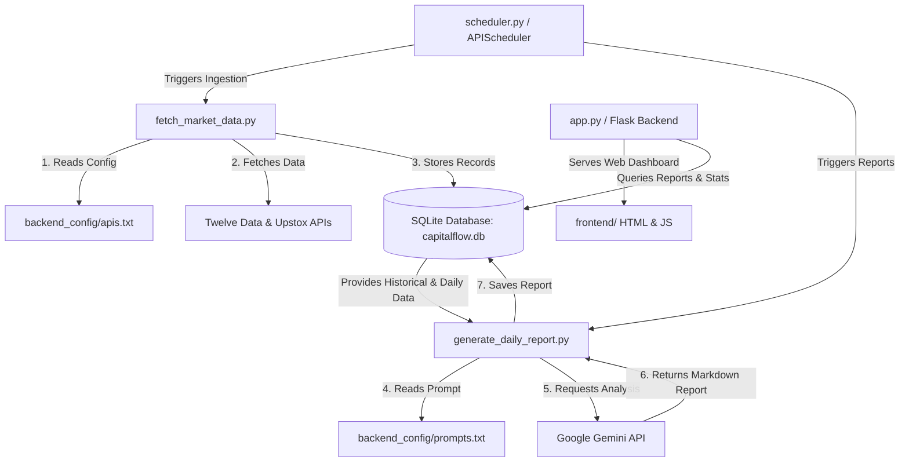

# CapitalFlowAI 📈

CapitalFlowAI is an automated, intelligent financial intelligence platform that tracks global macroeconomic indices, commodity trends, cryptocurrency movements, and domestic institutional capital flows. It integrates with the **Google Gemini API** to generate comprehensive daily and monthly global macro investment research reports in simple, easy-to-understand language.

---

## 🏗️ Architecture & Data Flow



---

## 🌟 Features

*   **21-Indicator Market Tracking:**
    *   **9 Global Equities:** NIFTY 50 (India), S&P 500 & NASDAQ (US), Shanghai Composite (China), Nikkei 225 (Japan), TAIEX (Taiwan), FTSE 100 (UK), CAC 40 (France), STOXX Europe 600.
    *   **4 Commodities:** Gold, Silver, Copper, Brent Crude Oil.
    *   **2 Cryptocurrencies:** Bitcoin, Ethereum.
    *   **4 Currency & Risk Indicators:** US 10Y Bond Yield, DXY (US Dollar Index), USD/INR Exchange Rate, VIX (Volatility Index).
    *   **2 Institutional Flow Metrics:** FII (Foreign Institutional Investor) Net Flow & DII (Domestic Institutional Investor) Net Flow.
*   **Gemini-Powered AI Reports:** Automatically analyzes the 21 indicators to construct detailed daily and monthly global macro research reports written in plain, clear, and layman-friendly English.
*   **Automatic Scheduler:** Automatically runs daily fetches and triggers reports using `APScheduler`.
*   **Modern Web Dashboard:** Displays current values, percentage returns, trends, FII/DII netflow summaries, interactive charts, and reports archives.
*   **Educational Materials:** Incorporates comprehensive guides on global markets, macro events, hedging, and diversification.

---

## 📂 Project Structure

```bash
├── app.py                      # Flask web application & JSON API routes
├── charts.py                   # Data visualization logic generating dashboard charts
├── database.py                 # SQLite database schema, initialization, & CRUD queries
├── fetch_market_data.py        # Connects to Twelve Data and Upstox to ingest data
├── generate_daily_report.py    # Daily Gemini-report orchestrator & fallback generator
├── generate_monthly_report.py  # Monthly statistics aggregator & Gemini-report generator
├── scheduler.py                # Ingestion & report automation using APScheduler
├── seed_history.py             # Utility to seed 365 days of historical data for testing
├── requirements.txt            # Python dependencies
├── backend_config/
│   ├── apis.txt                # Twelve Data & Upstox URL and parsing configurations
│   └── prompts.txt             # Structured instruction prompts for Gemini report gen
└── frontend/                   # UI dashboard templates and static resources
```

---

## ⚙️ Setup & Installation

### 1. Prerequisites
Ensure you have Python 3.8+ installed on your system.

### 2. Install Dependencies
```bash
pip install -r requirements.txt
```

### 3. Environment Configuration (`.env`)
Create a `.env` file in the root directory and configure the following keys:
```env
TWELVE_DATA_API_KEY=your_twelve_data_api_key_here
UPSTOX_BEARER_TOKEN=your_upstox_bearer_token_here
GEMINI_API_KEY=your_gemini_api_key_here
```

### 4. Seed Historical Data
To populate your SQLite database with 365 days of historical market data and simulated AI reports for verification:
```bash
python seed_history.py
```

### 5. Start the Web Server
Launch the Flask development server (database and background scheduler start automatically):
```bash
python app.py
```
Open [http://127.0.0.1:5000](http://127.0.0.1:5000) in your browser.

---

## 🔑 Gemini API Rate Limits (Google AI Studio Free Tier)

When using the free tier of the Gemini API (e.g., `gemini-2.5-flash`), the following limits apply:

| Limit Type | Rate Limit |
| :--- | :--- |
| **Requests Per Minute (RPM)** | 15 requests |
| **Tokens Per Minute (TPM)** | 1,000,000 tokens |
| **Requests Per Day (RPD)** | 1,500 requests |
| **Usage Window** | Indefinite (No 365-day expiry as of now) |

> [!NOTE]
> On the **Free Tier**, Google AI Studio may use prompts and responses for human review and model tuning to improve products. If data privacy is a priority, consider upgrading to the pay-as-you-go tier where user data is not stored or used for model training.
